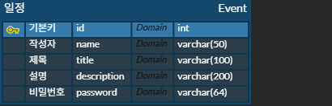

# EventPlanner - 일정 관리 애플리케이션

EventPlanner는 일정을 효율적으로 등록, 수정, 조회, 삭제할 수 있도록 돕는 일정 관리 웹 애플리케이션입니다.  
간단한 인증 구조와 CRUD 기능을 갖춘 백엔드 서비스로 구성되어 있습니다.

## 주요 기능
- 일정 생성(Create)
- 일정 전체 및 선택 조회(Read)
- 일정 수정(Update) — 비밀번호 인증 기반
- 일정 삭제(Delete) — 비밀번호 인증 기반

## API 명세서 & ERD
- 
- 